# WhiteFox Content: user manual

This guide is for WhiteFox colleagues. It shows how to turn a WhiteFox case study into
LinkedIn posts, website articles and outbound emails, with Claude doing the legwork and you
approving each result.

You need a Claude subscription (Pro or Max) and one of these:

- **Claude desktop app** (recommended): review pages, draft previews and the dashboard open as
  pages beside the chat.
- **Claude Code**: the same steps in the terminal. Each review happens in the chat, by typing.

Contents:

1. [Install the plugin](#1-install-the-plugin)
2. [Choose your workspace folder](#2-choose-your-workspace-folder)
3. [Connect DataForSEO (optional)](#3-connect-dataforseo-optional)
4. [Start a campaign](#4-start-a-campaign)
5. [Stage 1: add a case study](#5-stage-1-add-a-case-study)
6. [Stage 2: find topics](#6-stage-2-find-topics)
7. [Stage 3: write](#7-stage-3-write)
8. [Review pages: how to approve](#8-review-pages-how-to-approve)
9. [The dashboard](#9-the-dashboard)
10. [Getting a new version](#10-getting-a-new-version)
11. [Commands and words](#11-commands-and-words)
12. [Problems and fixes](#12-problems-and-fixes)

---

## 1. Install the plugin

You do this once.

### Claude desktop app

1. Open **Customize** (left menu), then the **Plugins** tab.
2. Click **+ Add** (top right), then **Add marketplace**.
3. Choose **Add from a repository**. In **URL**, paste `whitefoxcloud/whitefox-content-plugin`,
   leave **Sync automatically** on, and click **Sync**. The red trust warning is shown for every
   plugin outside Anthropic's own list; this one is WhiteFox's.
4. The **Discover** tab opens with **WhiteFox Content**. Click **Add** on its row (not
   *Try in chat*).
5. The plugin's page opens: the switch on the right is on and the version shows under the
   name. Start a new chat.

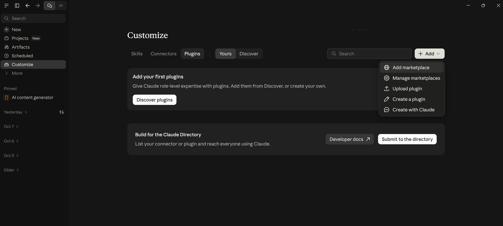

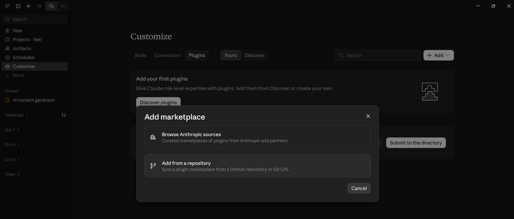

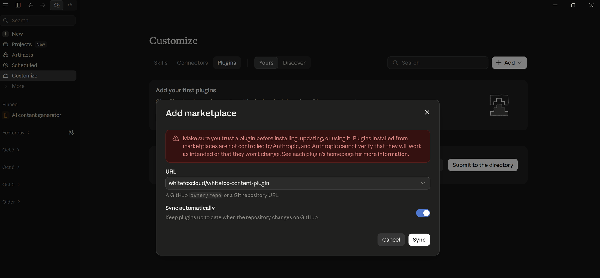

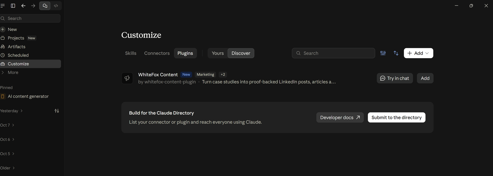

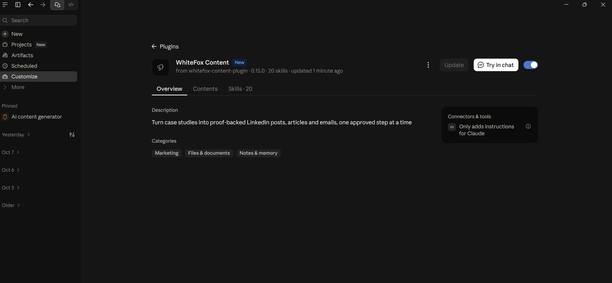

### Claude Code

Type these two commands:

```
/plugin marketplace add whitefoxcloud/whitefox-content-plugin
/plugin install wf-content@whitefox
```

Then start a new session. In Claude Code every command begins with `wf-content:`. For example,
`/whitefox-content-start` in the app is `/wf-content:whitefox-content-start` in Claude Code.


---

## 2. Choose your workspace folder

Everything you make (industries, case studies, campaigns, drafts) lives in one folder on your
laptop, called your workspace. You choose its name and place, for example
`Documents\WhiteFox Content`. The plugin itself holds no data.

1. In a new chat, type `/whitefox-content-start`, but do not send it yet.
2. Click **Project or folder** under the message box, then **Add folder**, and pick your
   workspace folder (or create an empty one with **New folder**), then **Select Folder**.
   The folder's name now shows under the message box. Then send.
   (Forgot? Claude asks which folder to use: paste the folder's path in your reply.)
3. Claude checks GitHub for a newer version of the plugin, and the app asks *Claude wants to
   fetch a web page* (raw.githubusercontent.com). Click **Always allow for this website**, so
   it does not ask again. (If you pasted a folder path instead, the app may also ask for folder
   access: tick **Don't ask again for this folder on this device**, then **Allow**.)
4. The first time, Claude lists what it will set up in the empty folder and asks your name (it
   goes into the files you create). Reply with your name and yes, for example *Sam, yes*.

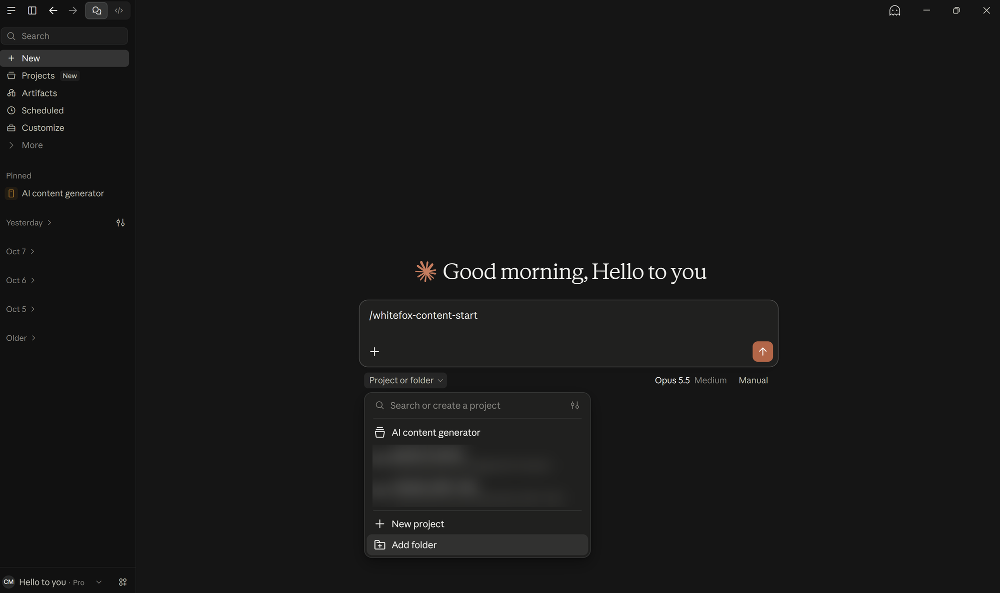

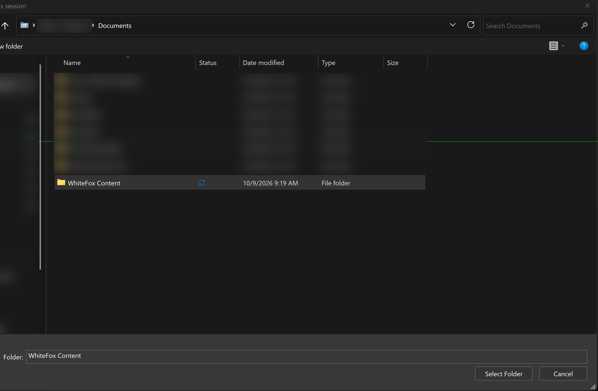

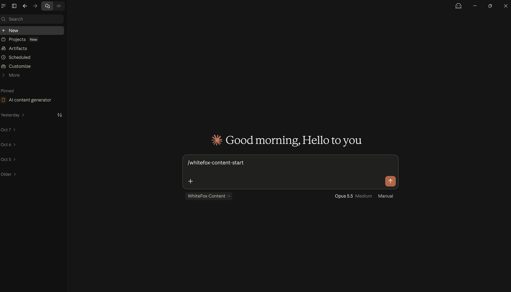

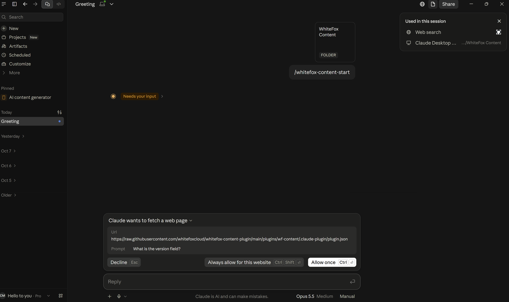

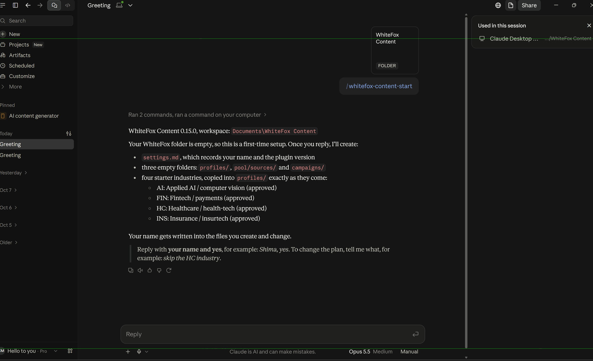

The workspace comes with four starter industries: financial services (FIN), insurance (INS),
healthcare (HC) and AI (AI).

---

## 3. Connect DataForSEO (optional)

DataForSEO gives real monthly search numbers for your topics. It is **only for people with the
company DataForSEO login**, and every call costs money (a few cents per topic). Everyone else
skips this section and uses the free check (questions and phrasing from web search, without
numbers).

Rules, whichever app you use:

- Never paste the DataForSEO login into a chat or a file. You sign in on DataForSEO's own page.
- The plugin only ever uses three DataForSEO tools: **Keyword Overview**, **Related Keywords**
  and **SERP Organic Live Advanced**. It shows the price first, and it spends only when you
  reply **paid** (at most $1.00 per topic).

### Claude desktop app

1. Open **Customize**, then **Connectors**. Click **+ Add**, then **Add custom connector**.
2. Name: `DataForSEO`. URL: `https://mcp.dataforseo.com/mcp`. Click **Continue**.
3. The next page shows sign-in options. Leave them as they are and click **Add**.
4. On the DataForSEO page, click **Connect**. Your browser opens DataForSEO's page: sign in
   with the company login if asked, then click **Approve**.
5. Back in the app, the connector shows its tool permissions. Every tool starts on the hand
   (**ask before use**). Leave it that way: never choose the tick (always allow).

   The connector marks its tools "read-only". That only means they change nothing at
   DataForSEO; they still cost money.

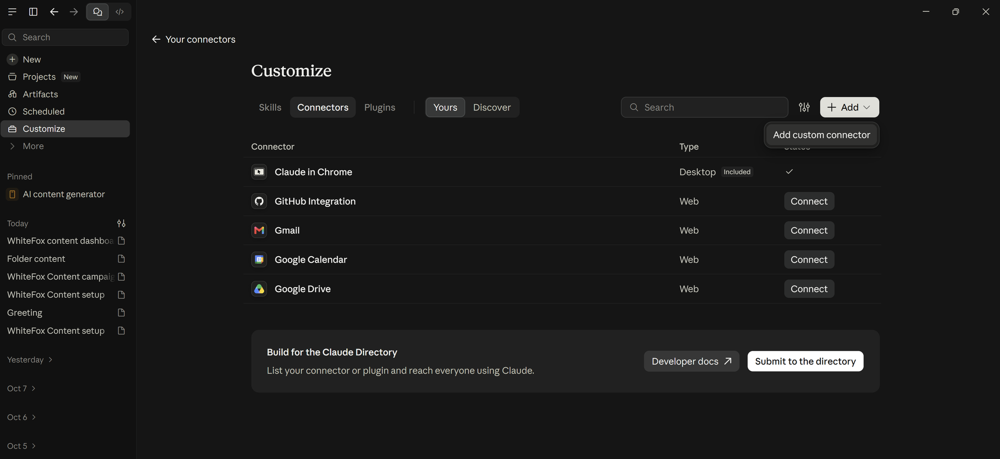

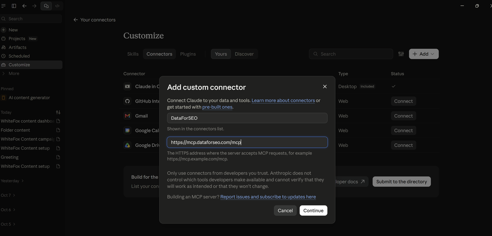

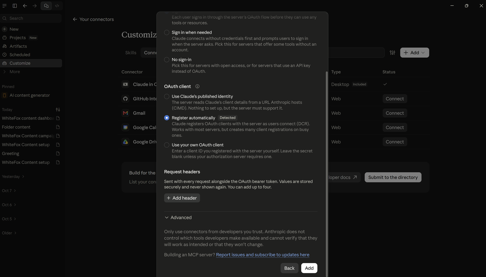

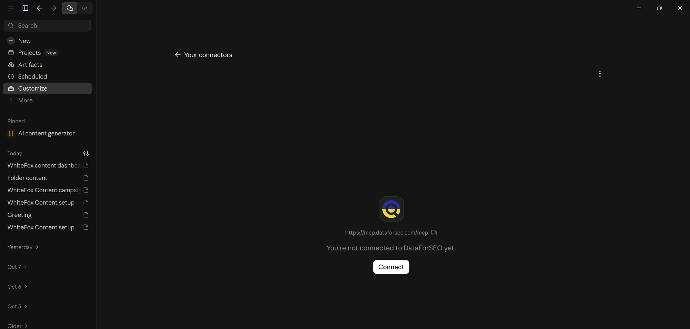

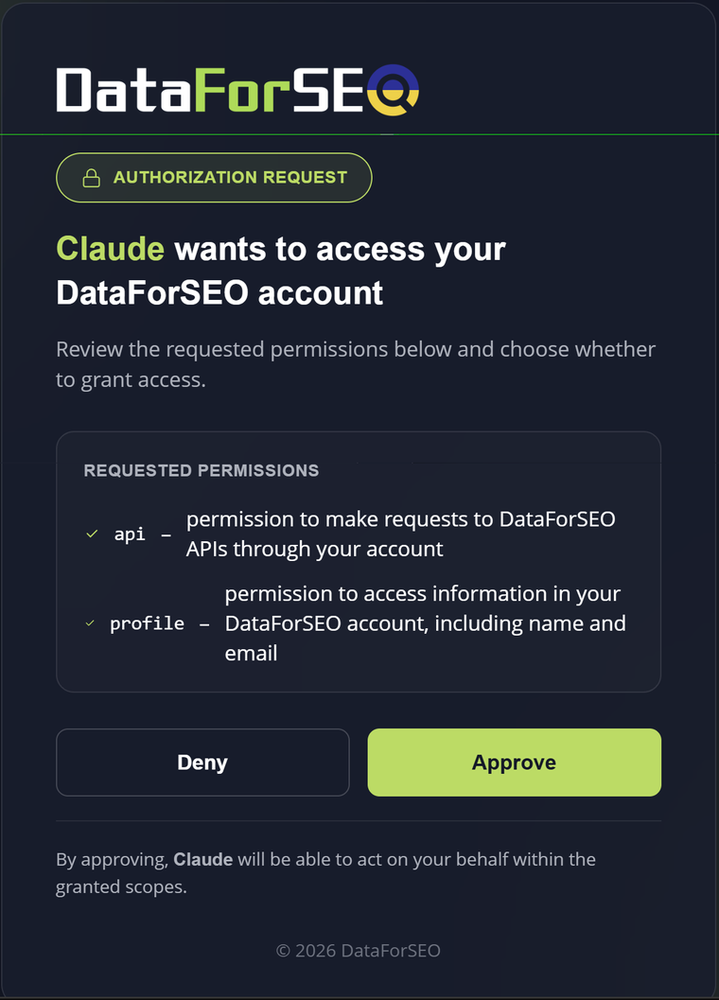

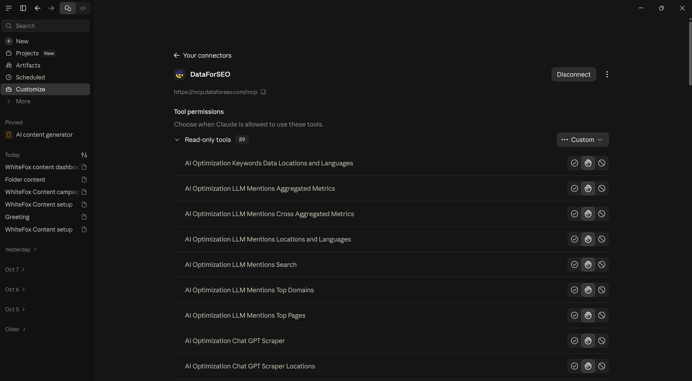

### Claude Code

Claude Code signed in with your Claude account already has the connectors you added in the
Claude app.

1. Set up the connector in the Claude app first (above).
2. In Claude Code, type `/mcp`. You should see **claude.ai DataForSEO** with the status
   *connected*. If it says it needs signing in, select it and sign in with the company login.
3. Claude Code asks before each DataForSEO call. Answer **Yes** for one call at a time, and
   never pick "don't ask again" for a DataForSEO tool.

If you use Claude Code without the Claude app, add the connector in the terminal instead:

```
claude mcp add --transport http dataforseo https://mcp.dataforseo.com/mcp
```

Then type `/mcp`, select **dataforseo** and sign in with the company login.

---

## 4. Start a campaign

A campaign is one push of content for one industry, with one goal, for example "insurance
leaders, October, systems integration".

1. Type `/whitefox-content-start`. Claude shows your industries and campaigns, and the
   dashboard opens on the right (section 9). Reply *start a new campaign*, or type
   `/whitefox-content-campaign`.
2. Claude asks which industry and what goal. Reply in one message, for example *FIN, start
   conversations with fintech founders and payments product leaders in Australia about
   building reliable real-time payments integrations*. No goal yet? Just give the industry.
3. Claude names the campaign (for example `ins-2026-10`) and asks for its case study. Go on to
   stage 1.

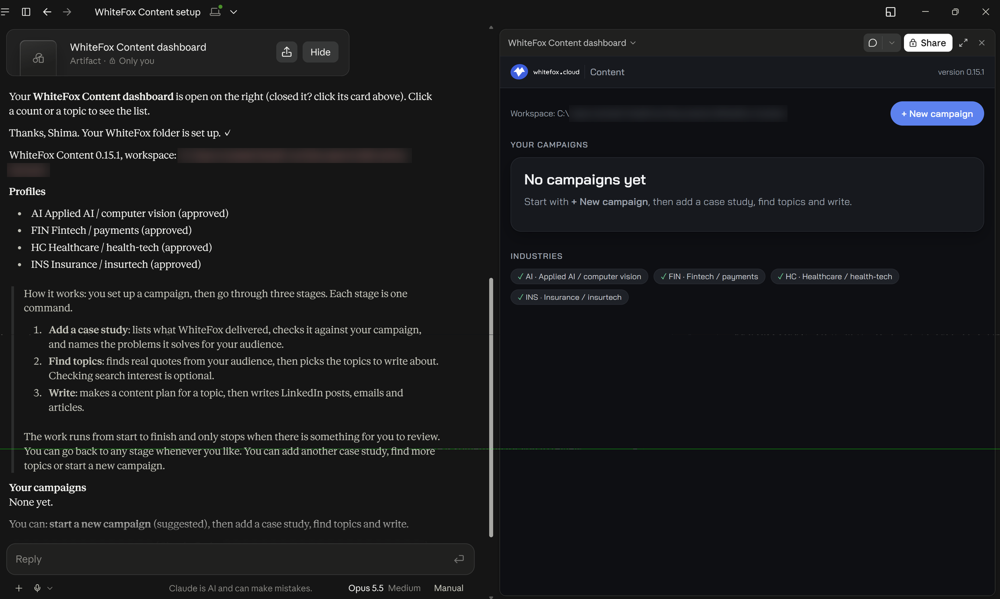

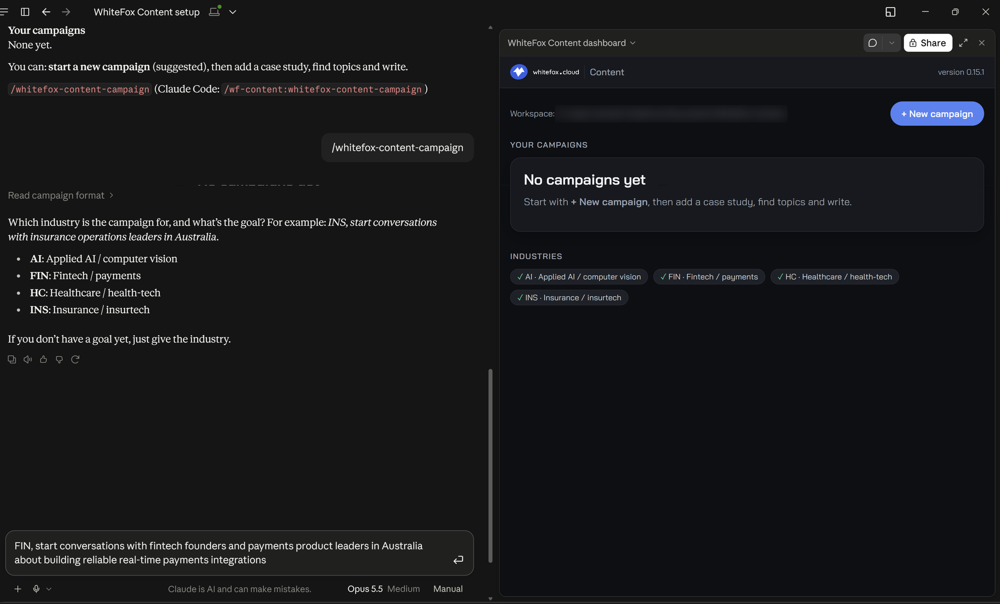

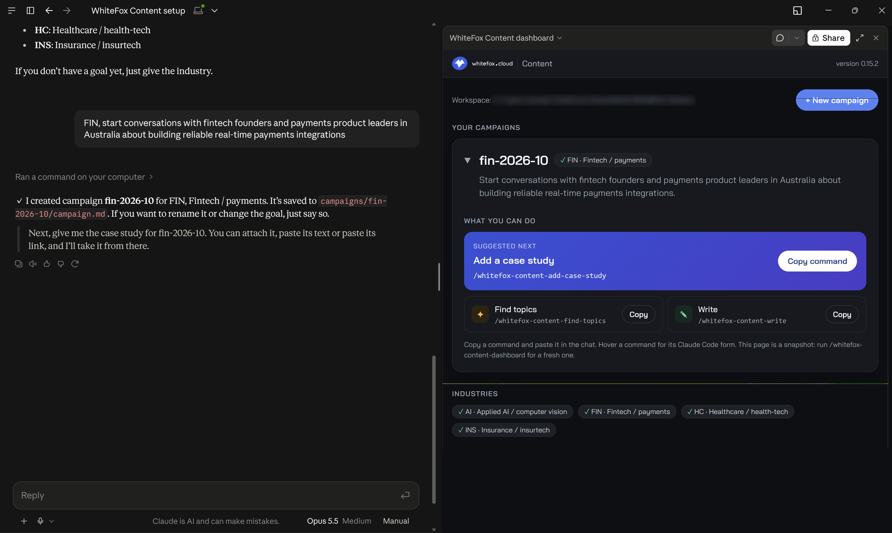

After the campaign exists, everything runs in three stages, one command each. Each stage runs
straight through, stops only when there is something for you to review, and then carries on
into the next stage. From a new campaign to the first drafts takes about seven replies:

| # | Your reply |
|---|---|
| 1 | industry and goal |
| 2 | the case study |
| 3 | review: what we delivered, and your audience's problems |
| 4 | review: the topics |
| 5 | free or paid search interest check |
| 6 | review: the content plan |
| 7 | review: the drafts |

Type **stop** any time. The same command carries on from where you stopped.

---

## 5. Stage 1: add a case study

Command: `/whitefox-content-add-case-study`

1. Right after creating a campaign, Claude already asks for the case study, so just answer.
   Later, type the command, or click **Copy command** on the dashboard and paste it. Claude
   says what the stage does and asks for the case study.
2. Attach the case study (PDF or Word file), paste its text, or paste its link. With a link,
   Claude opens the page in the app's browser. The first time, the app asks to allow
   whitefox.cloud: click **Always allow**.
3. Claude lists **what we delivered**: each piece of work WhiteFox really did, in whole
   sentences from the case study, and checks which ones fit your campaign's audience.
4. Claude names your **audience's problems** that this work solves, in your buyers' words.
5. Review both on the review page (section 8). Each delivery has **fits** (use it in this
   campaign), **doesn't fit** (keep it in the library, not for this campaign) or **drop** (do not
   save it). Each problem has **keep** or **drop**. Then **Copy my choices**, paste, send.

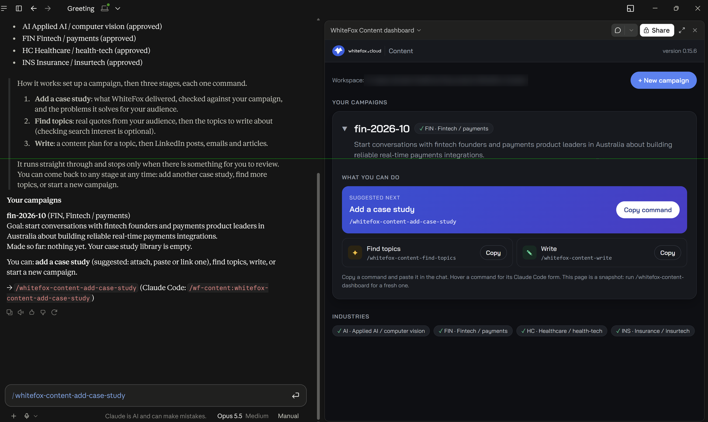

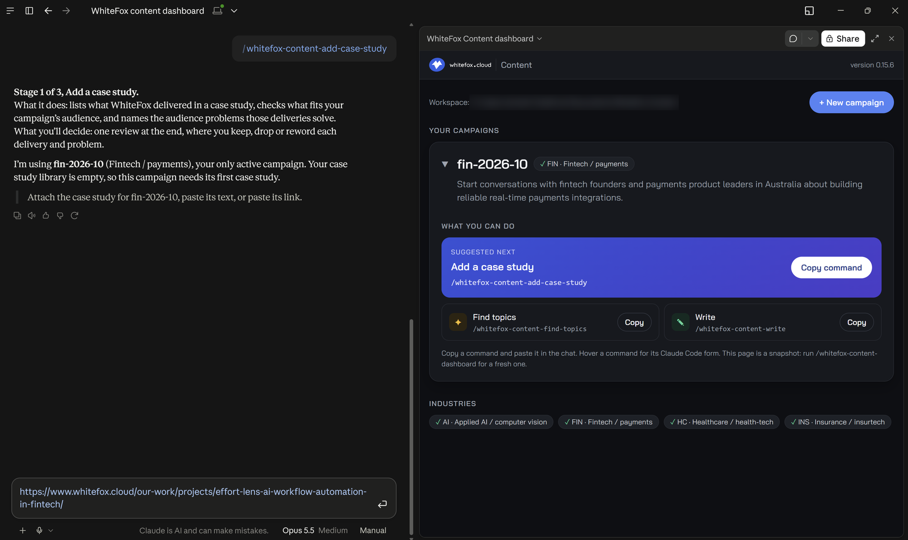

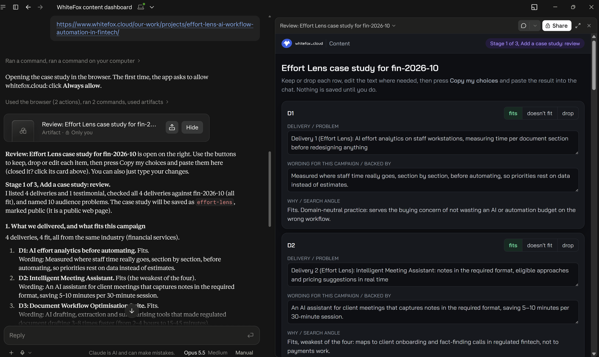

Delivered work goes into your case study library, so later campaigns can use it too.

---

## 6. Stage 2: find topics

Command: `/whitefox-content-find-topics`

1. Claude searches the public web (forums, interviews, reviews) for **audience quotes**: real
   buyers voicing the problems, word for word, each with its link. You see progress lines while
   it searches.
2. Claude proposes **topics**: one audience problem, plus what we delivered and the quotes
   behind it, framed as a position WhiteFox can own.
3. One review page holds the topics and the quotes. Mark each topic **chosen**, **idea** or
   **drop**, and each quote **keep** or **drop**. Chosen topics go on to stage 3. A topic needs
   something behind it: if you drop the only quote behind a topic with no delivery, that topic
   is not saved.

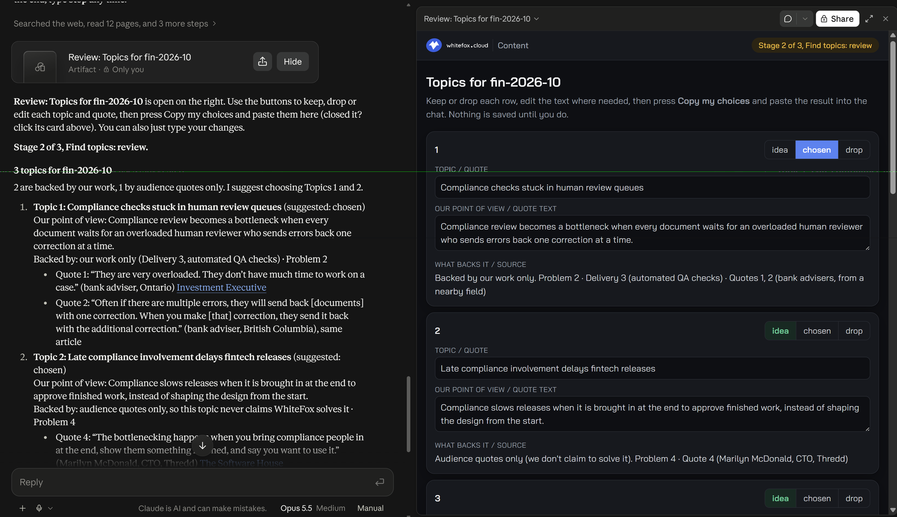

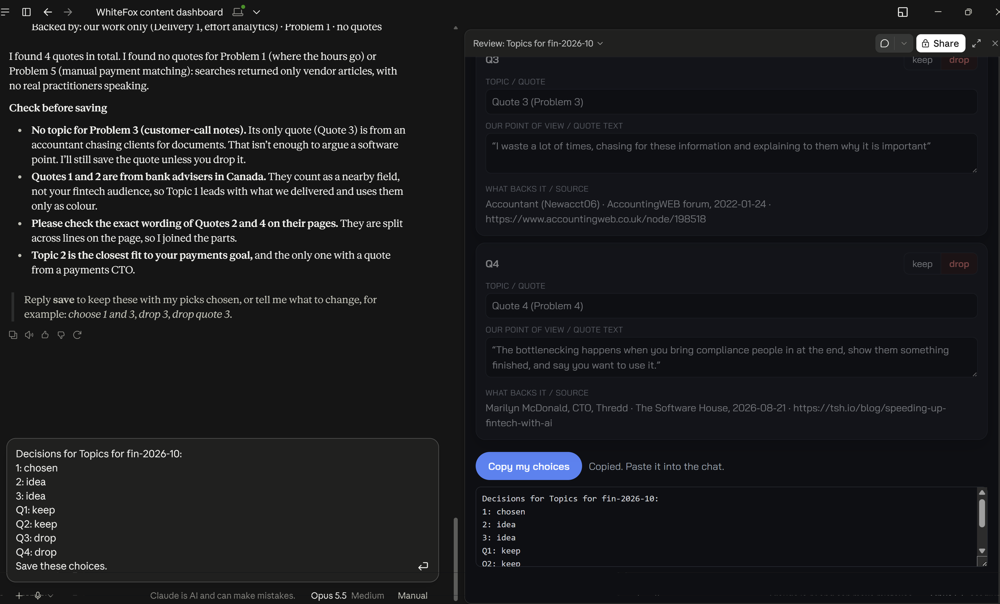

---

## 7. Stage 3: write

Command: `/whitefox-content-write`

For one chosen topic at a time:

1. **Search interest.** Claude asks one question: free or paid.
   - **free**: questions and phrasing from web search, no numbers, no cost.
   - **paid** (only with DataForSEO connected): real monthly searches. The question shows the
     number of calls and the price, and replying **paid** approves that spend. The app then
     asks before each DataForSEO call (about five): click **Allow once** each time, never
     Always allow.
2. **Content plan.** Claude plans the pieces for the topic: channel (LinkedIn, email or
   article), headline, who posts it (company, founder or engineer) and the keyword. Mark each
   piece **planned**, **later** or **drop**.
3. **Drafts.** Claude writes every planned piece and opens them in one preview page, one tab per
   draft, as they will look. Approve, or type what to change.
4. Claude saves the drafts and offers the next chosen topic. Reply **next** to plan it.

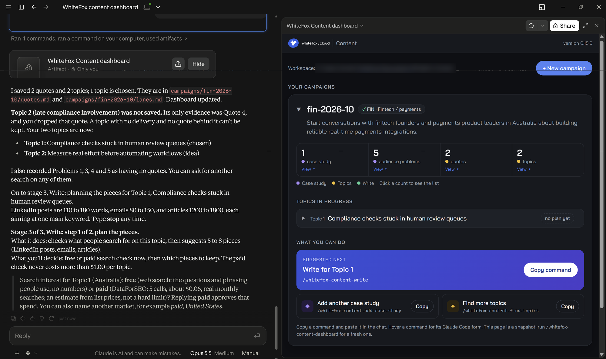

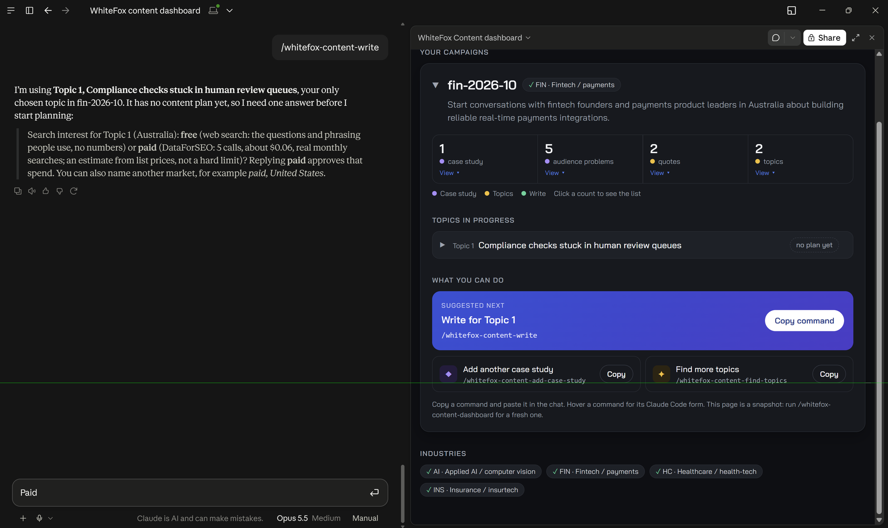

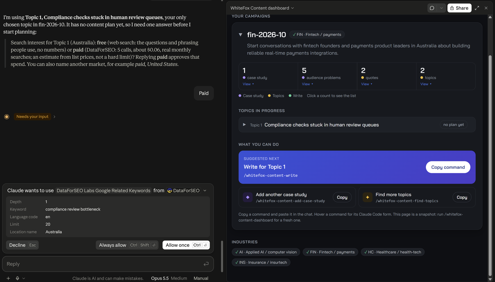

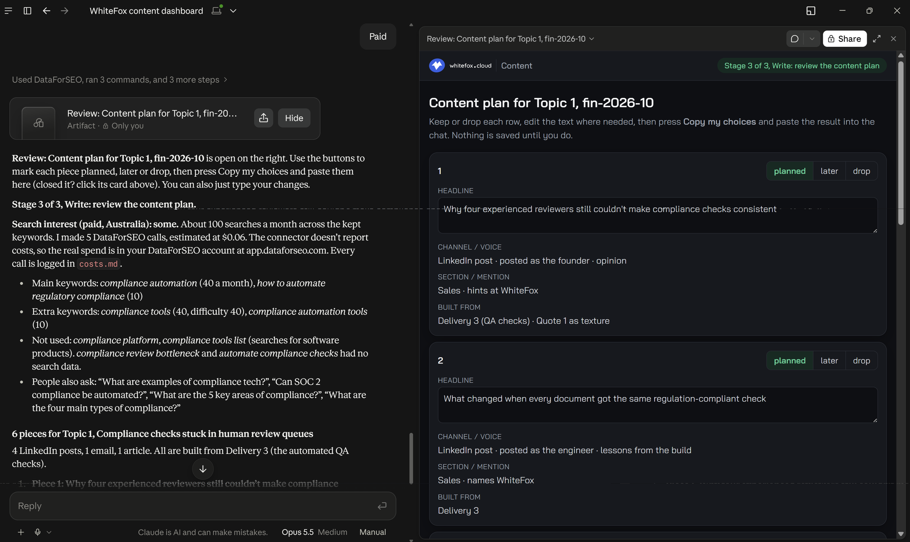

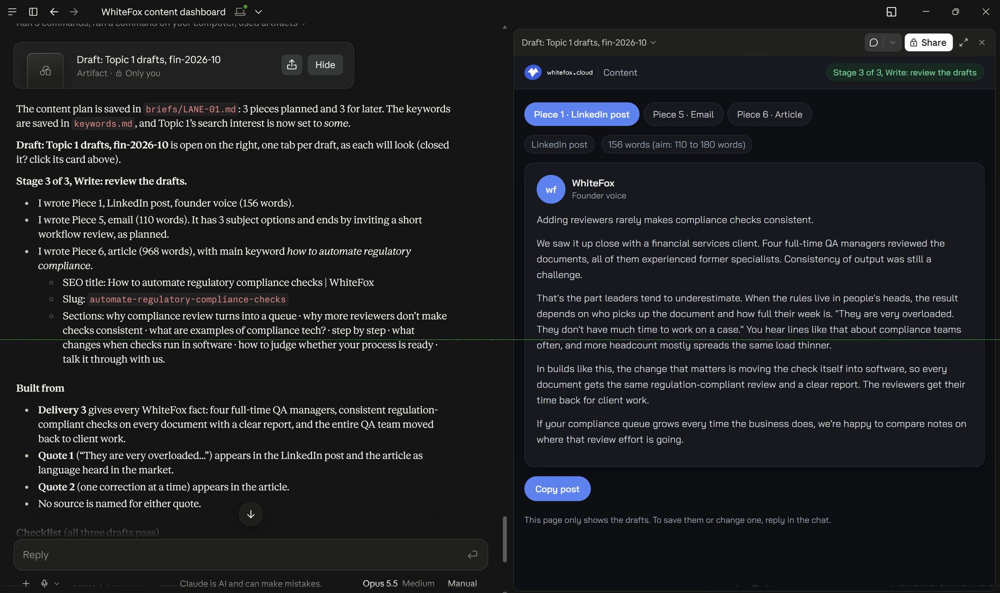

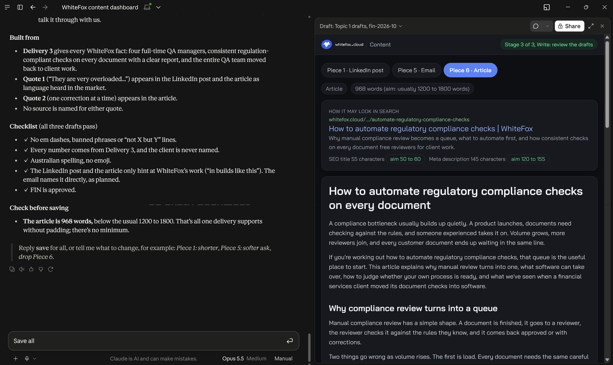

Drafts are saved in your campaign's `drafts` folder. Copy the text from the preview page with
its copy button, or open the file.

---

## 8. Review pages: how to approve

When a result has three or more items, a review page opens on the right of the chat (closed
it? click its card above your reply).

1. For each row, pick a choice with the buttons (for example keep or drop), or edit the text.
   Text copied from a source, such as a quote or a case study sentence, cannot be edited.
2. Add a row with the **Add** button at the bottom of the page if something is missing.
3. Press **Copy my choices**, paste into the chat and send.
4. Claude shows the result once more. Reply **yes** to save.

You can always skip the page and just type your changes, for example *drop 3, keep the rest*.
Nothing is saved before you approve.

In Claude Code there are no pages: Claude lists the items in the chat and you type your
choices.

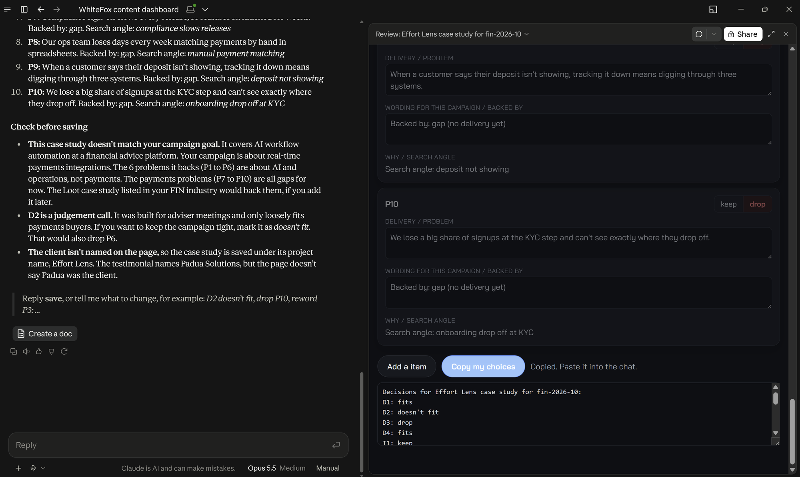

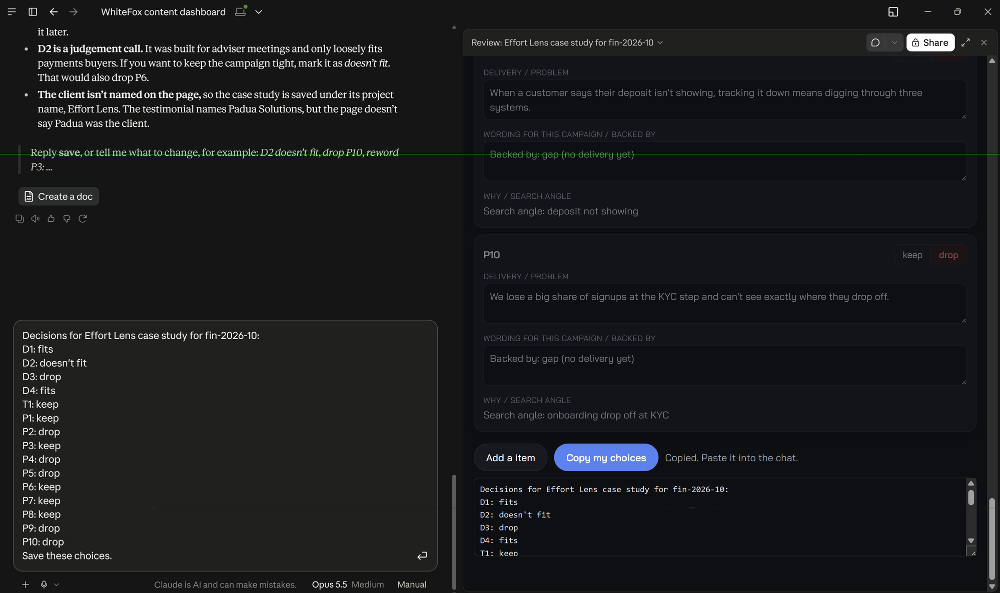

---

## 9. The dashboard

Command: `/whitefox-content-dashboard` (it also opens with `/whitefox-content-start`)

The dashboard shows every campaign, newest first:

- what has been made so far (case studies, problems, quotes, topics, drafts): click a count to
  see the list,
- topics in progress: click one to expand it,
- **Open** on a draft shows it on the page as it will look, with copy buttons,
- the next actions, one of them suggested, and **+ New campaign**.

While it is open, Claude refreshes it after each milestone (a campaign created, a review
saved, drafts saved). The dashboard only shows; it never changes anything. To see one saved item in the chat, use
`/whitefox-content-show`, for example `/whitefox-content-show Topic 3 ins-2026-10`.

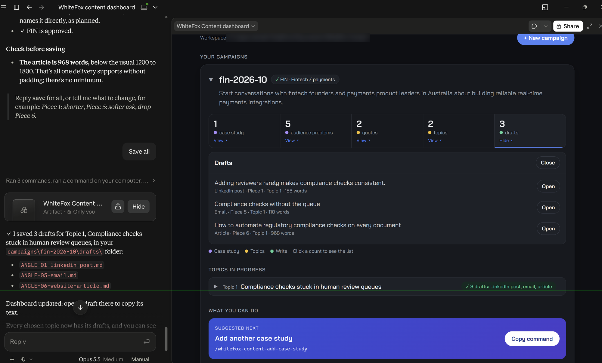

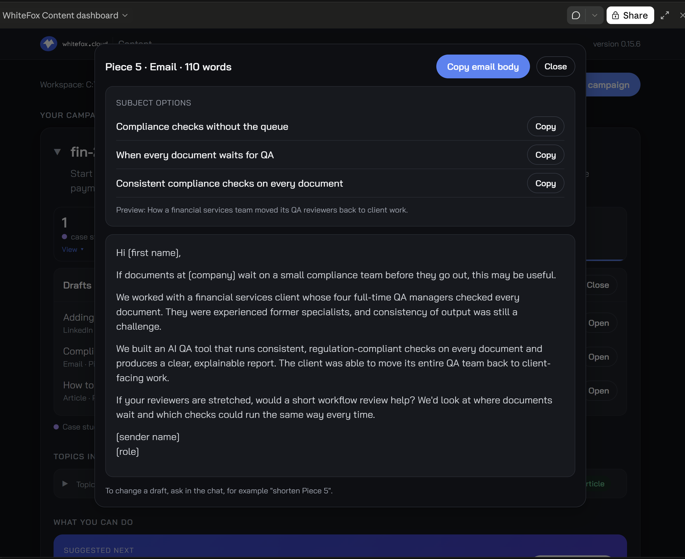

---

## 10. Getting a new version

`/whitefox-content-start` tells you when a newer version exists.

- **Claude app:** Customize, Plugins, WhiteFox Content, the **⋯** menu, **Check for updates**,
  then **Update**. Start a new chat afterwards (open chats keep the old version).
- **Claude Code:** `/plugin marketplace update whitefox`, then start a new session.

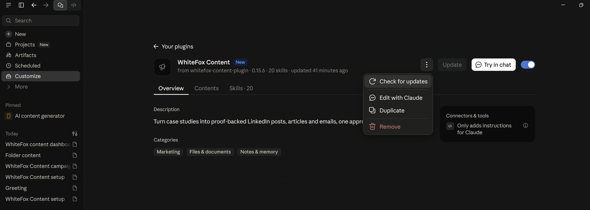

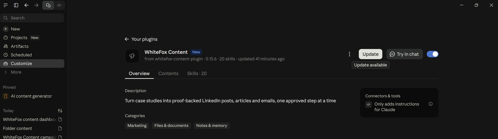

---

## 11. Commands and words

| Claude app | Claude Code | What it does |
|---|---|---|
| `/whitefox-content-start` | `/wf-content:whitefox-content-start` | where each campaign stands, and the next step |
| `/whitefox-content-campaign` | `/wf-content:whitefox-content-campaign` | create, pause, resume or finish a campaign |
| `/whitefox-content-add-case-study` | `/wf-content:whitefox-content-add-case-study` | stage 1 |
| `/whitefox-content-find-topics` | `/wf-content:whitefox-content-find-topics` | stage 2 |
| `/whitefox-content-write` | `/wf-content:whitefox-content-write` | stage 3 |
| `/whitefox-content-dashboard` | `/wf-content:whitefox-content-dashboard` | the dashboard page |
| `/whitefox-content-show` | `/wf-content:whitefox-content-show` | one saved item |
| `/whitefox-content-guide` | `/wf-content:whitefox-content-guide` | how the workflow works |

Words the plugin uses:

- **What we delivered:** one piece of work WhiteFox really did, from a case study.
- **Audience problem:** a problem your campaign's audience has, that this work solves.
- **Audience quote:** a real buyer saying it, word for word, with its link.
- **Topic:** one audience problem, plus what we delivered and the quotes behind it.
- **Content plan:** the pieces planned for one topic.
- **Piece:** one LinkedIn post, email or article.
- **Industry:** who a campaign is for, how WhiteFox is positioned there, and which words to use
  or avoid.

---

## 12. Problems and fixes

| What you see | What to do |
|---|---|
| "This marketplace is already added" | It is installed already. Go to Plugins, Discover, and click **Add** on WhiteFox Content (or update it, section 10). |
| A command is not found | Start a new chat (or session). In Claude Code, add `wf-content:` in front. |
| Claude asks for the folder every time | Pick it with **Project or folder** before sending (section 2). |
| The page on the right is gone | Click the page's card above Claude's reply. |
| "DataForSEO is not connected" | Expected without the company login: choose free. With the login, see section 3. |
| A DataForSEO call fails or the balance is empty | Nothing is retried without your yes. Choose free, and tell the DataForSEO account owner. |
| A new version does not show | Check for updates (section 10), then start a new chat. |

If something else goes wrong, take a screenshot and send it to the plugin owner.

---

## Screenshots to add

Save each image in `docs/images/` with this name:

| File | Shows |
|---|---|
| `01-app-plugins-add-button.png` | Claude app, Customize, Plugins, with the + (Add marketplace) button visible |
| `02-app-marketplace-from-repository.png` | the Add marketplace window: Browse Anthropic sources or Add from a repository |
| `03-app-add-marketplace.png` | Add from a repository: URL pasted, Sync automatically on, Sync button |
| `04-app-install-plugin.png` | Plugins, Discover: WhiteFox Content with its Add button |
| `05-app-plugin-added.png` | the WhiteFox Content page after Add: version, switch on, Try in chat |
| `06-code-install-plugin.png` | Claude Code after `/plugin install wf-content@whitefox` |
| `07-app-add-folder.png` | Project or folder menu under the message box, with Add folder |
| `08-app-pick-folder.png` | the Windows folder picker with WhiteFox Content selected |
| `09-app-folder-chosen.png` | /whitefox-content-start typed, WhiteFox Content shown under the message box |
| `10-app-allow-version-check.png` | "Claude wants to fetch a web page" for the version check |
| `11-app-first-setup.png` | first-time setup in an empty folder: what Claude will create, asks name and yes |
| `12-app-dataforseo-add-menu.png` | Customize, Connectors, + Add open with Add custom connector |
| `13-app-dataforseo-add.png` | Add custom connector with name and URL filled in |
| `14-app-dataforseo-sign-in-options.png` | the sign-in options page with the Add button |
| `15-app-dataforseo-connect.png` | "You're not connected to DataForSEO yet" with Connect |
| `16-app-dataforseo-approve.png` | DataForSEO's authorization page with Approve |
| `17-app-dataforseo-permissions.png` | the connected DataForSEO page, tool permissions on ask |
| `18-start.png` | the start reply with the dashboard open on the right |
| `19-new-campaign.png` | /whitefox-content-campaign: the industry and goal question, with the answer typed |
| `20-app-campaign-created.png` | campaign created in the chat, dashboard showing it with Add a case study suggested |
| `21-app-stage1-start.png` | the start reply, with /whitefox-content-add-case-study typed (or copied from the dashboard) |
| `22-add-case-study.png` | the stage 1 opener asking for the case study, with the link pasted |
| `23-review-deliveries.png` | stage 1 review page: one row per delivery with fits, doesn't fit, drop |
| `24-review-topics.png` | stage 2 review: topics with their quotes in the chat, topics page on the right |
| `25-topics-quotes-choices.png` | quote rows (keep, drop) on the topics page, choices pasted |
| `26-free-or-paid.png` | topics saved, dashboard updated, the free or paid question with the price |
| `27-app-write-paid.png` | /whitefox-content-write run on its own: the free or paid question, answer typed |
| `28-app-dataforseo-allow.png` | "Claude wants to use DataForSEO ..." with Allow once |
| `29-review-content-plan.png` | search interest results in the chat, content plan review page (planned, later, drop) |
| `30-draft-preview.png` | draft preview with tabs, LinkedIn post open, Built from in the chat |
| `31-draft-article.png` | the article tab with its search preview, checklist in the chat, save typed |
| `32-review-page.png` | any review page, buttons and Copy my choices visible |
| `33-paste-choices.png` | the copied "Decisions for" lines pasted in the chat |
| `34-dashboard.png` | drafts saved, dashboard updated, the drafts list open with Open buttons |
| `35-dashboard-draft.png` | a draft opened inside the dashboard |
| `36-app-update.png` | the plugin's ⋯ menu with Check for updates |
| `37-app-update-button.png` | after the check: Update available, the Update button |

Use test data only (for example the fin-2026-10 campaign), and crop out names, emails and
other chats.
